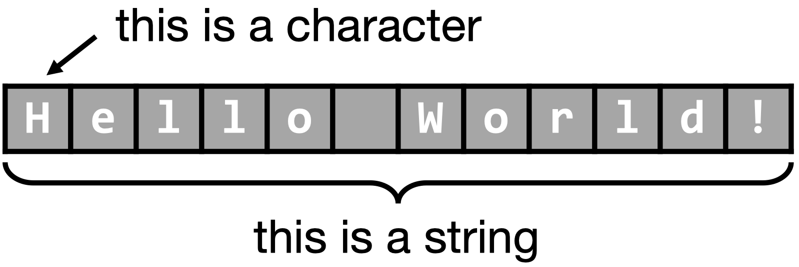

```{css, echo=FALSE} 
@media print { # print out incremental slides; see https://stackoverflow.com/questions/56373198/get-xaringan-incremental-animations-to-print-to-pdf/56374619#56374619
  .has-continuation {
    display: block !important;
  }
}
```

```{r setup, include=FALSE}
# figures formatting setup
options(htmltools.dir.version = FALSE)
library(knitr)
opts_chunk$set(
  prompt = T,
  fig.align="center", #fig.width=6, fig.height=4.5, 
  # out.width="748px", #out.length="520.75px",
  dpi=300, #fig.path='Figs/',
  cache=F, #echo=F, warning=F, message=F
  engine.opts = list(bash = "-l")
  )

## Next hook based on this SO answer: https://stackoverflow.com/a/39025054
knit_hooks$set(
  prompt = function(before, options, envir) {
    options(
      prompt = if (options$engine %in% c('sh','bash')) '$ ' else 'R> ',
      continue = if (options$engine %in% c('sh','bash')) '$ ' else '+ '
      )
})

library(tidyverse)
```


# Table of contents

<br>

1. [Web data for data science](#webdata)

2. [HTML basics](#html)

3. [XPath basics](#xpath)

4. [CSS basics](#css)

5. [Regular expressions](#regex)

6. [Summary](#summary)


---
class: inverse, center, middle
name: webdata

# Web data for data science

<html><div style='float:left'></div><hr color='#EB811B' size=1px style="width:1000px; margin:auto;"/></html>


---
# What is web data?

<br>
<div align="center">


</div>


---
# What is web data? (cont.)

<br>
<div align="center">


</div>

---
# What is web data? (cont.)

.pull-left[

### So what is web data, really?

- Not all data you get from the web is "web data".
- Web data is **data that is created on, for, or via the web**. By that definition, a survey dataset that you download from a data repository is not web data.
- On the other hand, survey data collected online (i.e., web/mobile questionnaires) is web data but we don't consider it in today's session.
- Examples of web data: 
  - Online news articles
  - Social media network structures
  - Crowdsourced databases (e.g., Wikidata)
  - Server logs (e.g., viewership statistics)
  - Data from surveys, experiments, clickworkers
  - Just any website
  
]

--

.pull-right[

### And why is web data attractive?

- Data is abundant online.
- Human behavior increasingly takes place online.
- Countless services track human behavior.
- Getting data from the web is cheap and often quick.
- An analysis workflow that involves web data can often be easily updated.
- The vast majority of web data was not created with a data analysis purpose in mind. This fact is often a feature, not a bug.

]


---
# Technologies of the world wide web

.pull-left[

- To fully unlock the potential of web data for data science, we draw on certain web technologies.
- Importantly, often a basic understanding of these technologies is sufficient as the focus is on web data collection, not [web development](https://en.wikipedia.org/wiki/Web_development).
- Specifically, we have to understand
  - How our machine/browser/R communicates with web servers (→ **HTTP/S**)
  - How websites are built (→ **HTML**, **CSS**, basics of **JavaScript**)
  - How content in webpages can be effectively located (→ **XPath**, **CSS selectors**)
  - How dynamic web applications are executed and tapped (→ **AJAX**, **Selenium**)
  - How data by web services is distributed and processed (→ **APIs**, **JSON**, **XML**)
  
]

.pull-right-center[
<div align="center">
<br>

</div>
`Credit` [ADCR](http://r-datacollection.com/)
]


---
class: inverse, center, middle
name: html

# HTML basics

<html><div style='float:left'></div><hr color='#EB811B' size=1px style="width:1000px; margin:auto;"/></html>


---
# HTML background

.pull-left-wide[

### What is HTML?

- **H**yper**T**ext **M**arkup **L**anguage
- Markup language = plain text + markups
- Originally specified by [Tim Berners-Lee](https://en.wikipedia.org/wiki/Tim_Berners-Lee) at [CERN](https://en.wikipedia.org/wiki/CERN) in 1989/90 
- [W3C](https://en.wikipedia.org/wiki/World_Wide_Web_Consortium) standard for the construction of websites.
- The fundamentals of HTML haven't changed much recently. Current version is HTML 5.2 (published in 2017). 


### What is it good for?

- In the early days, the internet was mainly good for sharing texts. But plain text is boring. <span style="font-family:Comic Sans MS">Markup</span> <span style="color:purple">is</span> *fun*!
- HTML lies underneath of what you see in your browser. You don't see it because your browser interprets and renders it for you.
- A basic understanding of HTML helps us locate the information we want to retrieve.

]

.pull-right-small-center[

<br>
<div align="center">

<br><br>

</div>

]


---
# HTML tree structure

.pull-left[

### The DOM tree

- HTML documents are hierarchically structured. Think of them as a tree with multiple nodes and branches.
- When a webpage (HTML resource) is loaded, the browser creates a [Document Object Model](https://en.wikipedia.org/wiki/Document_Object_Model) of that page - the **DOM Tree**.
- Think of it as a representation that considers all HTML elements as objects than can be accessed.

### Parts of the tree

- The DOM is constituted of **nodes**, which are just data types that can be referred to - such as "attribute node", "text node", or "element node".
- A **node set** is a set of nodes. This will become relevant when you learn about XPath, which you can use to access multiple nodes (e.g., all `title` nodes).
]

.pull-right[

```{html, prompt = FALSE, eval = FALSE}
<!DOCTYPE html> 
  <html> 
    <head>
      <title id=1>First HTML</title>
    </head>
  <body>
    I am your first HTML file! 
  </body>
</html>
```

<div align="center">

</div>
]

---
# HTML: elements and attributes

.pull-left[
### Elements

- Elements are a combination of start tags, content, and end tags.
- Example: `<title>First HTML</title>`
- An element is everything from (including) the element's start tag to (including) the element's end tag, but also other elements that are nested within that element.
- Syntax:

| Component  |  Representation |
|---|---|
| Element title  | `title` |
|  Start tag |  `<title>` |
|  End tag |  `</title>` |
|  Value |  `First HTML` |
]

.pull-right[
### Attributes

- Describe elements and are stored in the start tag.
- There are specific attributes for specific elements.
- Example: `<a href="http://www.r-datacollection.com/">Link to Homepage</a>`
- Syntax:
  - Name-value pairs: `name="value"`
  - Simple and double quotation marks possible
  - Several attributes per element possible
  
### Why tags and attributes are important

- Tags structure HTML documents.
- In the context of web scraping, the structure can be exploited to locate and extract data from websites.

]

---
# Important tags and attributes

### Anchor tag `<a>`

- Links to other pages or resources.
- Classical links are always formatted with an anchor tag.
- The `href` attribute determines the target location.
- The value is the name of the link.

Link to another resource:
```{html, eval = FALSE, prompt = FALSE}
<a href="en.wikipedia.org/wiki/List_of_lists_of_lists">Link with absolute path</a>
```

Reference within a document:
```{html, eval = FALSE, prompt = FALSE}
<a id="top">Reference point</a>
```

Link to a reference within a document:
```{html, eval = FALSE, prompt = FALSE}
<a href="#top">Link to reference point</a>
```

---
# Important tags and attributes

### Heading tags `<h1>`, `<h2>`, ..., and paragraph tag `<p>`

- Structure text and paragraphs.
- Heading tags range from level 1 to 6.
- Paragraph tag induces a line break.

Examples:
```{html, eval = FALSE, prompt = FALSE}
<p>This text is going to be a paragraph one day and separated from other text by line breaks.</p>
```

```{html, eval = FALSE, prompt = FALSE}
<h1>heading of level 1 - this will be BIG</h1>
...
<h6>heading of level 6 - the smallest heading</h6>
```


---
# Important tags and attributes

### Listing tags `<ul>`, `<ol>`, and `<dl>`

- The `<ol>` tag creates a numeric list.
- The `<ul>` tag creates an unnumbered list.
- The `<dl>` tag creates a description list.
- List elements within `<ol>` and `<ul>` are indicated with the `<li>` tag.

Example:
```{html, prompt = FALSE, eval = FALSE}
<ul>
  <li>Dogs</li>
  <li>Cats</li>
  <li>Fish</li>
</ul>
```


---
# Important tags and attributes

### Organizational and styling tags `<div>` and `<span>`

- They are used to group content over lines (`<div>`, creating a block-level element) or within lines (`<span>`, creating an inline-element).
- By grouping or dividing content into blocks, it's easier to identify or apply different styling to them.
- They do not change the layout themselves but work together with CSS (see later!).

.pull-left[
Example of CSS definition:

```{css, prompt = FALSE, eval = FALSE}
div.happy {
  color:pink; 
  font-family:"Comic Sans MS";
  font-size:120% 
} 
span.happy { 
  color:pink; 
  font-family:"Comic Sans MS"; 
  font-size:120% 
}
```
]

.pull-right[
In the HTML document:

```{html, prompt = FALSE, eval = FALSE}
<div class="happy">
  <p>I am a happy-styled paragraph</p>
</div>
  
unhappy text with <span class="happy">some 
happiness</span>
```
]


---
# Important tags and attributes

### Form tag `<form>`

- Allows to incorporate HTML forms.
- Client can send information to the server via forms.
- Whenever you type something into a field or click on radio buttons in your browser, you are interacting with forms.

Example:

```{html, prompt = FALSE, eval = FALSE}
<form name="submitPW" action="Passed.html" method="get">
  password:
  <input name="pw" type="text" value="">
  <input type="submit" value="SubmitButtonText">
</form>
```


---
# Important tags and attributes

### Table tags `<table>`, `<tr>`, `<td>`, and `<th>`

- Standard HTML tables always follow a standard architecture.
- The different tags allow defining the table as a whole, individual rows (including the heading), and cells.
- If the data is hidden in tables, scraping will be straightforward.

Example:

```{html, prompt = FALSE, eval = FALSE}
<table> 
  <tr> <th>Rank</th> <th>Nominal GDP</th> <th>Name</th> </tr> 
  <tr> <th></th> <th>(per capita, USD)</th> <th></th> </tr> 
  <tr> <td>1</td> <td>170,373</td> <td>Lichtenstein</td> </tr> 
  <tr> <td>2</td> <td>167,021</td> <td>Monaco</td> </tr> 
  <tr> <td>3</td> <td>115,377</td> <td>Luxembourg</td> </tr> 
  <tr> <td>4</td> <td>98,565</td> <td>Norway</td> </tr> 
  <tr> <td>5</td> <td>92,682</td> <td>Qatar</td> </tr>
</table>
```


---
# More resources on HTML

.pull-left-wide[

### More HTML
- All in all there are over 100 HTML elements.
- But overall, it's still a fairly tight and easy-to-understand markup language.
- Knowing more about the rest is probably not necessary to become a good web scraper, but it helps parsing (in your brain) HTML documents quicker.

### More resources
- Check out the excellent [MDN Web Docs](https://developer.mozilla.org/en-US/docs/Web/HTML) for an overview, which also point to additional tutorials and references.
- The [W3Schools tutorials](https://www.w3schools.com/) are also a classic.
- While you're at it, you might also want to learn about related technologies such as CSS (used to specify a webpage's appearance/layout) and JavaScript (used to enrich HTMLs with additional functionality and options to interact).

]

.pull-right-small[
<div align="center">
<br><br><br>


<br>


</div>
]


---
# Accessing the web using your browser vs. R

.pull-left-wide[

### Using your browser to access webpages

1. You click on a link, enter a URL, run a Google query, etc.
2. Browser/your machine sends request to server that hosts website.
3. Server returns resource (often an HTML document).
4. Browser interprets HTML and renders it in a nice fashion.

### Using R to access webpages

1. You manually specify a resource.
2. R/your machine sends a request to the server that hosts the website.
3. The server returns a resource (e.g., an HTML file).
4. R parses the HTML, but does not render it in a nice fashion.
5. It's up to you to tell R what content to extract.

]

.pull-right-small[
<div align="center">
<br><br>

<br><br><br>

</div>
]


---
# Interacting with your browser

### On web browsers

- Modern browsers are complex pieces of software that take care of multiple operations while you browse the web. And they're basically all doing a good job.<sup>1</sup> Common operations are to retrieve resources, render and display information, and provide interface for user-webpage interaction.
- Although our goal is to automate web data retrieval, the browser is an important tool in web scraping workflow.

### The use of browsers for web scraping

- Give you an intuitive impression of the architecture of a webpage
- Allow you to inspect the source code
- Let you construct XPath/CSS selector expressions with plugins
- Render dynamic web content (JavaScript interpreter)

.footnote[<sup>1</sup> Check out this Wikipedia article on the [Browser Wars](https://en.wikipedia.org/wiki/Browser_wars) that happened in the 1990s and 2000s (yes, there was Browser War I and Browser War II - and for once Germany was not to blame) to relive some of your instructor's pains when he started to look into this "internet".]


---
# Inspecting HTML source code

.pull-left-small[
<br><br><br>
- Goal: retrieving data from a Wikipedia page on [List of tallest buildings](https://en.wikipedia.org/wiki/List_of_tallest_buildings)
- Right-click on page (anywhere)
- Select `View Page Source`
- HTML (CSS, JavaScript) code can be ugly
- But looking more closely, we find the displayed information
]

.pull-right-wide[
<br>
<video width="768" height="432" controls>
  <source src="pics/inspect-pagesource.mp4" type="video/mp4">
Your browser does not support the video tag.
</video>
]


---
# Inspecting the live HTML source code with the DOM explorer

.pull-left-small[
- Goal: retrieving data from a Wikipedia page on [List of tallest buildings](https://en.wikipedia.org/wiki/List_of_tallest_buildings)
- Right-click on the element of interest
- Select `Inspect`
- The Web Developer Tools window pops up
- Corresponding part in the HTML tree is highlighted
- Interaction with the tree possible!
]

.pull-right-wide[
<video width="768" height="432" controls>
  <source src="pics/inspect-pagedom.mp4" type="video/mp4">
Your browser does not support the video tag.
</video>
]

---
# When to do what with your browser

.pull-left-wide[

### When to inspect the complete page source

- Check whether data is in static source code (the search function helps!)
- For small HTML files: understand structure

### When to use the DOM explorer

- Almost always
- Particularly useful to construct XPath/CSS selector expressions
- To monitor dynamic changes in the DOM tree

### A note on browser differences

- Inspecting the source code (as shown on the following slides) works more or less identically in Chrome and Firefox.
- In Safari, go to → `Preferences`, then → `Advanced` and select `Show Develop menu in menu bar`. This unlocks the `Show Page Source` and `Inspect` options and the Web Developer Tools.
]

.pull-right-small-center[
<br>
<div align="center">

</div>

`Credit` [watershedcreative.com](http://watershedcreative.com/naked/html-tree.html)
]


---
class: inverse, center, middle
name: xpath

# XPath basics

<html><div style='float:left'></div><hr color='#EB811B' size=1px style="width:1000px; margin:auto;"/></html>

---
# Accessing the DOM tree with R

### Different perspectives on HTML

- HTML documents are human-readable.
- HTML tags structure the document, comprising the DOM.
- **Web user perspective**: The browser interprets the code and renders the page.
- **Web scraper perspective**: Parse the document retaining the structure, use the tree/tags to locate information.

--

### HTML parsing

- Our goal is to get HTML into R while retaining the tree structure. That's similar to getting a spreadsheet into R and retaining the rectangular structure.
- HTML is human-readable, so we could also import HTML files as plain text via `readLines()`. That's a bad option though - the document's structure would not be retained.
- The `xml2` package allows us to parse XML-style documents. HTML is a "flavor" of XML, so it works for us.
- The `rvest` package, which we will mainly use for scraping, wraps the `xml2` package, so we rarely have to load it manually. 
- There is one high-level function to remember: `read_html()`. It represents the HTML in a list-style fashion.

---
# Accessing the DOM tree with R (cont.)

### Getting HTML into R

Parsing a website is straightforward:

```{r, eval = TRUE, message= FALSE}
library(rvest)
parsed_doc <- read_html("https://google.com")
parsed_doc
```

There are various functions to inspect the parsed document. They aren't really helpful - better use the browser instead if you want to dive into the HTML.

```{r, eval = FALSE, message= FALSE}
xml2::html_structure(parsed_doc)
xml2::as_list(parsed_doc)
```

---
# What's XPath?

### Definition

- Short for **XML Path Language**, another W3C standard.
- A query language for XML-based documents (including HTML).
- With XPath we can access node sets (e.g., elements, attributes) and extract content.

### Why XPath for web scraping?

- Source code of webpages (HTML) structures both layout and content.
- Not only content, but context matters!
- XPath enables us to extract content based on its location in the document (and potentially other features).
- With XPath, we can tell R to do things like:
  1. Give me all `<li>` elements in the document!
  2. Look for all `<table>` elements in the document and give me the third one!
  3. Extract all content in `<p>` elements that is labelled with `class=newscontent`! 


---
# Example: source code

```{html, prompt = FALSE, eval = FALSE}
<!DOCTYPE HTML PUBLIC "-//IETF//DTD HTML//EN">
<html> 
 <head>
  <title>Collected R wisdoms</title>
 </head>
 <body>
  <div id="R Inventor" lang="english" date="June/2003">
   <h1>Robert Gentleman</h1>
    <p><i>'What we have is nice, but we need something very different'</i></p>
    <p><b>Source: </b>Statistical Computing 2003, Reisensburg</p>
  </div>
  <div lang="english" date="October/2011">
   <h1>Rolf Turner</h1>
    <p><i>'R is wonderful, but it cannot work magic'</i> 
    <br><emph>answering a request for automatic generation of 'data from a known mean and 95% CI'</emph></p>
    <p><b>Source: </b><a href="https://stat.ethz.ch/mailman/listinfo/r-help">R-help</a></p>
  </div>
  <address>
   <a href="http://www.rdatacollectionbook.com"><i>The book homepage</i></a>
  </address>
 </body> 
</html>
```

---
# Example: DOM tree

<div align="center">

</div>


---
# Applying XPath on HTML in R

- Load package `rvest`
- Parse HTML document with `read_html()`

```{r, eval = TRUE, message= FALSE}
library(rvest)
parsed_doc <- read_html("materials/fortunes.html")
parsed_doc
```

- Query document using `html_elements()`
- `rvest` can process XPath queries as well as CSS selectors.
- Today, we'll focus on XPath:

```{r, eval = TRUE, message= FALSE}
html_elements(parsed_doc, xpath = "//div[last()]/p/i")
```


---
# Grammar of XPath

### Basic rules

1. We access nodes/elements by writing down the hierarchical structure in the DOM that locates the element set of interest.
2. A sequence of nodes is separated by `/`.
3. The easiest localization of a element is given by the absolute path (but often not the most efficient one!).
4. Apply XPath on DOM in R using `html_elements()`.

```{r, eval = TRUE, message= FALSE}
html_elements(parsed_doc, xpath = "//div[last()]/p/i")
```


---
# Grammar of XPath

### Absolute vs. relative paths

**Absolute paths** start at the root element and follow the whole way down to the target element (with simple slashes, `/`).

```{r, eval = TRUE, message= FALSE}
html_elements(parsed_doc, xpath = "/html/body/div/p/i")
```

**Relative paths** skip nodes (with double slashes, `//`).

```{r, eval = TRUE, message= FALSE}
html_elements(parsed_doc, xpath = "//body//p/i")
```

Relative paths are often preferrable. They are faster to write and more comprehensive. On the other hand, they are less targeted and therefore potentially less robust, and running them takes more computing time, as the entire tree has to be evaluated. But that's usually not relevant for reasonably small documents.

---
# Grammar of XPath

### The wildcard operator

- Meta symbol `*`
- Matches any element
- Works only for one arbitrary element
- Far less important than, e.g., wildcards in content-based queries (regex!)

```{r, eval = TRUE, message= FALSE}
html_elements(parsed_doc, xpath = "/html/body/div/*/i")

# the following does not work:
html_elements(parsed_doc, xpath = "/html/body/div/*/i")
```

---
# Grammar of XPath

### Navigational operators `"."`and `".."`

- `"."` accesses elements on the same level ("self axis"), which is useful when working with predicates (see later!).
- `".."` accesses elements at a higher hierarchical level.

```{r, eval = TRUE, message= FALSE}
html_elements(parsed_doc, xpath = "//title/..")
```

```{r, eval = TRUE, message= FALSE}
html_elements(parsed_doc, xpath = "//div[starts-with(./@id, 'R')]")
```


---
# Element (node) relations ("axes") in XPath

.pull-left[
### Family relations between elements

- The tools learned so far are sometimes not sufficient to access specific elements without accessing other, undesired elements as well.
- Relationship statuses are useful to establish unambiguity. 
- Can be combined with other elements of the grammar
- Basic syntax: `element1/relation::element2`
- We describe relation of `element2` to `element1`
- `element2` is to be extracted - we always extract the element at the end!
]

.pull-right[
<div align="center">
<br>

</div>
]

---
# Element (node) relations in XPath

| <div style="width:230px">Axis name</div> |  Description |
|---|---|
| `ancestor`  | All ancestors (parent, grandparent etc.) of the current element |
| `ancestor-or-self` | All ancestors of the current element and the current element itself |
| `attribute` |  All attributes of the current element |
| `child` | All children of the current element  |
| `descendant` | All descendants (children, grandchildren etc.) of the current element  |
| `descendant-or-self` |  All descendants of the current element and the current element itself |
| `following` | Everything in the document after the closing tag of the current element  |
| `following-sibling`  | All siblings after the current element  |
| `parent` | The parent of the current element  |
| `preceding` | All elements that appear before the current element, except ancestors/attribute elements  |
| `preceding-sibling` | All siblings before the current element  |
| `self` | The current element  |

---
# Element (node) relations in XPath

Example: access the `<div>` elements that are ancestors to an `<a>` element:

```{r, eval = TRUE, message= FALSE}
html_elements(parsed_doc, xpath = "//a/ancestor::div")
```

Another example: Select all `<h1>` nodes that precede a `<p>` node:

```{r, eval = TRUE, message= FALSE}
html_elements(parsed_doc, xpath = "//p/preceding-sibling::h1")
```


---
# Predicates

### What are predicates?

- Predicates are conditions based on an element's features (`true/false`).
- Think of them as ways to filter nodesets.
- They are applicable to a variety of features: name, value attribute.
- Basic syntax: `element[predicate]`

Select all first `<p>` elements that are children of a `<div>` element, using a **numeric predicate**:

```{r, eval = TRUE, message= FALSE}
html_elements(parsed_doc, xpath = "//div/p[1]")
```

--

Can you find out what the following expressions do? 

```{r, eval = FALSE, message= FALSE}
html_elements(parsed_doc, xpath = "//div/p[last()-1]") 
html_elements(parsed_doc, xpath = "//div[count(./@*)>2]")
html_elements(parsed_doc, xpath = "//*[string-length(text())>50]")
```

---
# Predicates (cont.)

Select all `<div>` nodes that contain an attribute named `’October/2011’`, using a **textual predicate**:

```{r, eval = TRUE, message= FALSE}
html_elements(parsed_doc, xpath ="//div[@date='October/2011']")
```

Rudimentary string matching is also possible using string functions like `contains()`, `starts-with()`, or `ends-with()`.

--

Can you tell what the following calls do?

```{r, eval = FALSE, message= FALSE}
html_elements(parsed_doc, xpath = "//div[starts-with(./@id, 'R')]")
html_elements(parsed_doc, xpath = "//div[substring-after(./@date, '/')='2003']//i")
```

---
# Content extraction 

- Until now, we used XPath expressions to extract complete nodes or nodesets (that is, elements with tags).
- However, in most cases we're interested in extracting the content only.
- To that end, we can use extractor functions that are applied on the output of XPath query calls.

| Function  |  Argument | Return value |
|---|---|---|
| `html_text()` |  | Element value |
| `html_text2()` |  | Element value (with a bit more cleanup) |
| `html_attr()` | `name` | Element attribute |
| `html_attrs()` |  | (All) element attributes |
| `html_name()` | `trim` | Element name |
| `html_children()` |  | Element children |


---
# Content extraction (cont.)

Extracting **element values/content**:

```{r, eval = TRUE}
html_elements(parsed_doc, xpath = "//title") %>% html_text2()
```

Extracting **attributes**:

```{r, eval = TRUE}
html_elements(parsed_doc, xpath = "//div[1]") %>% html_attrs()
```

Extracting **attribute values**:

```{r, eval = TRUE}
html_elements(parsed_doc, xpath = "//div") %>% html_attr("lang")
```


---
# More XPath?

### Training resources

- XPath is a little language of its own. As always with languages, mastery comes with practice.
- A good environment for practice is the [XPath expression testbed at whitebeam.org](http://www.whitebeam.org/library/guide/TechNotes/xpathtestbed.rhtm).
- Also check out this [cheat sheet](https://devhints.io/xpath).

### XPath creator tools

- Now, do you really have to construct XPath expressions by your own? No! At least not always.
- **SelectorGadget**: [http://selectorgadget.com](http://selectorgadget.com) is a browser plugin that constructs XPath statements via a point-and-click approach. The generated expressions are not always efficient and effective though (more on this later).
- Web developer tools - the internal browser functionality to study the DOM, among other things, also lets you extract XPath statements for selected nodes. These are specific to unique nodes/elements though, and therefore less helpful to extract node sets. (But they come in handy when we want to script live navigation, e.g. for Selenium.)


---
class: inverse, center, middle
name: css

# CSS basics

<html><div style='float:left'></div><hr color='#EB811B' size=1px style="width:1000px; margin:auto;"/></html>


---
# What is CSS?

.pull-left[
### Background

- **C**ascading **S**tyle **S**heets (CSS) is a style sheet language that allows web developers to adjust the "look and feel" of websites.
- By using CSS to adjust style features such as layout, colors, and fonts, it's easier to separate content (HTML) from presentation (CSS).

### Three ways to insert CSS into HTML

1. **External CSS.** Inside `<head>` with a reference to the external file inside the `<link>` element.
2. **Internal CSS.** Inside `<head>` and stored in `<style>` elements. 
3. **Inline CSS.** Inside `<body>` using the `style` attribute of elements.
  
]

--

.pull-right[
**External CSS**
```{html, prompt = FALSE, eval = FALSE}
<head>
  <link rel="stylesheet" href="mystyle.css">
</head>
```

**Internal CSS**
```{html, prompt = FALSE, eval = FALSE}
<head>
   <style>
      h1 {
         color: red;
         margin-left: 20px;
      }
   </style>
</head>
```

**Inline CSS**
```{html, prompt = FALSE, eval = FALSE}
<p style="color: blue;">This is a paragraph.</p>
```
]

---
# CSS selectors

.pull-left[

### Selectors

- CSS selectors find/select the HTML elements that should be styled.
- There are various categories of selectors. In addition to generic element selectors (which selected just based on the element name, such as `<p>`), we often care about:
  - **CSS id selectors**, which use the `id` attribute of an HTML element. Think of them as "labels", as in `<p id="para1">`. The respective CSS selector would be `#para1`.
  - **CSS class selectors**, which use the `class` attribute of an HTML element, as in `<p class = "center large">`. Note that these can refer to more than one class (here: `center` and `large`). The respective CSS selector would be `p.center.large`.

]

--

.pull-right[

### Writing CSS selectors

- Just as XPath, CSS selectors are a little language of their own.
- I won't teach you more about it, but you might nevertheless want to learn it.
- Check out the CSS diner tutorial at https://flukeout.github.io/. It's one of the best tutorials of anything out there.

<div align="center">

</div>
]


---
class: inverse, center, middle
name: regex

# Regular expressions

<html><div style='float:left'></div><hr color='#EB811B' size=1px style="width:1000px; margin:auto;"/></html>


---
# What are regular expressions?

.pull-left[
### Definition

Regular expressions a.k.a. *regex* or *RegExp* is a tool - a little language of it's own really - that lets you describe patterns in text/strings.

Funnily, a regular expression itself is a sequence of characters, some with special, some with literal meaning.

Regular expressions are widely applicable and implemented in many programming languages, including R, as well as search engines, search and replace dialogs, etc.

<div align="center">

</div>
]

--

.pull-right[
### Why is this useful for web scraping?

Information on the web can often be described by patterns (think email addresses, numbers, cells in HTML tables, ...).

If the data of interest follow specific patterns, we can match and extract them - regardless of page layout and HTML overhead.

Whenever the information of interest is (stored in) text, regular expressions are useful for extraction and tidying purposes.
]


---
# Regular expressions: example

Below you see a string that contains unstructured phone book entries. The goal is to clean it up and extract the entries. The problem is that the text is really messy, and to find a pattern that helps us describe names on the one hand and phone numbers on the other is difficult. But: regular expressions FTW!

```{r}
phone_vec <- 
"555-1239Moe Szyslak(636) 555-0113Burns, C. Montgomery
555-6542Rev. Timothy Lovejoy555 8904Ned Flanders636-555-3226
Simpson,Homer5553642Dr. Julius Hibbert"
```

--

We're loading the `stringr` package that provides us with tidyverse functionality to operate with string data and apply regular expressions. Then, we construct a regular expression each for the names and the phone numbers (this is the tricky part!). Finally, we apply the regular expressions on the raw vector to extract the information of interest.

---
# Regular expressions: example

```{r}
phone_vec <- 
"555-1239Moe Szyslak(636) 555-0113Burns, C. Montgomery
555-6542Rev. Timothy Lovejoy555 8904Ned Flanders636-555-3226
Simpson,Homer5553642Dr. Julius Hibbert"
```

--

```{r}
library(stringr)
names_vec <- unlist(str_extract_all(phone_vec, "[[:alpha:]., ]{2,}"))
names_vec
```

--

```{r}
numbers_vec <- unlist(str_extract_all(phone_vec, 
                                      "\\(?([:digit:]{3})?\\)?(-| )?[:digit:]{3}(-| )?[:digit:]{4}"))
numbers_vec
```

--

Wait, wait?! 🤯

---
# 🎶 Regex superheroooo 🎶

<div align="center">

</div>


---
# Regular expressions in R

Here's an example string we're going to work with:

```{r}
example.obj <- "1. A small sentence. - 2. Another tiny sentence."
```

--

We are going to use the `str_extract()` and the `str_extract_all()` functions from the `stringr` package to apply regular expressions to strings. The generic syntax is:

- `str_extract(string, pattern)`
- `str_extract_all(string, pattern)`

Here's the difference: `str_extract()` returns the first match, `str_extract_all()` returns all matches.

---
# Basic regex syntax

```{r}
example.obj <- "1. A small sentence. - 2. Another tiny sentence."
```

.pull-left[
### Strings match themselves

```{r}
str_extract(example.obj, "small")
str_extract(example.obj, "banana")
```
]

--

.pull-right[
### Multiple matches are returned as a list

```{r}
multi_vec <- c("text", "manipulation", "basics")
str_extract_all(multi_vec, "a")
```
]


---
# Basic regex syntax *cont.*

```{r}
example.obj <- "1. A small sentence. - 2. Another tiny sentence."
```

.pull-left[
### Character matching is case sensitive

```{r}
str_extract(example.obj, "small")
str_extract(example.obj, "SMALL")
str_extract(example.obj, 
            regex("SMALL", ignore_case = TRUE))
```
]

--

.pull-right[
### We can match arbitrary combinations of characters

```{r}
str_extract(example.obj, "mall sent")
```
]


---
# Basic regex syntax *cont.*

```{r}
example.obj <- "1. A small sentence. - 2. Another tiny sentence."
```

.pull-left[
### Matching the beginning of a string

```{r}
str_extract(example.obj, "^1")
str_extract(example.obj, "^2")
```
]

--

.pull-right[
### Matching the end of a string

```{r}
str_extract(example.obj, "sentence$")
str_extract(example.obj, "sentence.$")
```
]


---
# Basic regex syntax *cont.*

```{r}
example.obj <- "1. A small sentence. - 2. Another tiny sentence."
```

.pull-left[
### Express an "or" with the pipe operator

```{r}
unlist(str_extract_all(example.obj, "tiny|sentence"))
```
]

--

.pull-right[
### The dot: the ultimate wildcard

```{r}
str_extract(example.obj, "sm.ll")
```
]


---
# Meta-characters

### Matching of meta-characters

- Some symbols have a special meaning in the regex syntax: `.`, `|`, `(`, `)`, `[`, `]`, `{`, `}`, `^`, `$`, `*`, `+`, `?`, and `-`.
- If we want to match them literally, we have to use an escape sequence: `\symbol`
- As `\` is a meta character itself, we have to escape it with `\`, so we always write `\\`. 🤯
- Alternatively, use `fixed("symbols")` to let the parser interpret a chain of symbols literally.

```{r}
unlist(str_extract_all(example.obj, "\\."))
unlist(str_extract_all(example.obj, fixed(".")))
```


---
# Character classes

### Square brackets `[]` define character classes

- Character classes help define special wild cards. 
- The idea is that any of the characters within the brackets can be matched.

```{r}
str_extract(example.obj, "sm[abc]ll")
```

- The hyphen defines a range of characters.

```{r}
str_extract(example.obj, "sm[a-p]ll")
```

---
# Character classes *cont.*

Some character classes are pre-defined. They are very convenient to efficiently describe specific string patterns.

| Specification | Meaning |
  |---|---|
  | `[:digit:]`  | Digits: 0 1 2 3 4 5 6 7 8 9 |
  | `[:lower:]`  | Lower-case characters: a-z |
  | `[:upper:]`  | Upper-case characters: A-Z |
  | `[:alpha:]`  | Alphabetic characters: a-z and A-Z |
  | `[:alnum:]`  | Digits and alphabetic characters |
  | `[:punct:]`  | Punctuation characters: `.`, `,`, `;`, etc. |
  | `[:graph:]`  | Graphical characters: `[:alnum:]` and `[:punct:]` |
  | `[:blank:]`  | Blank characters: Space and tab |
  | `[:space:]`  | Space characters: Space, tab, newline, and others |
  | `[:print:]`  | Printable characters: `[:alnum:]`, `[:punct:]` and `[:space:]`|


---
# Character classes in action

Pre-defined character classes are useful because they are efficient and let us
- combine different kinds of characters
- facilitate reading of an expression
- include special characters, e.g., ß, ö, æ, ...
- can be extended

```{r}
unlist(str_extract_all(example.obj, "[[:punct:]ABC]"))
unlist(str_extract_all(example.obj, "[^[:alnum:]]"))
```


---
# Meta symbols in character classes

Within a character class, most meta-characters lose their special meaning. There are exceptions though: 

- `^` becomes "not":  `[^abc]` matches any character other than "a", "b", or "c".
- `-` becomes a range specifier: `[a-d]` matches any character from a to d. However, `-` at the beginning or the end of a character class matches the hyphen. 

```{r}
unlist(str_extract_all(example.obj, "[1-2]"))
unlist(str_extract_all(example.obj, "[12-]"))
```


---
# Quantifiers

Quantifiers are meta-characters that allow you to specify how often a certain string pattern should be allowed to appear.

| Quantifier | Meaning |
  |---|---|
  | `?`  | The preceding item is optional and will be matched at most once |
  | `*`  | The preceding item will be matched zero or more times |
  | `+`  | The preceding item will be matched one or more times |
  | `{n}`  | The preceding item is matched exactly n times |
  | `{n,}`  | The preceding item is matched n or more times |
  | `{n,m}`  |  The preceding item is matched between n and m times |

```{r}
str_extract(example.obj, "s[[:alpha:]]{3}l")
str_extract(example.obj, "A.+sentence")
```


---
# Greedy quantification

The use of `.+` results in "greedy" matching, i.e. the parser tries to match as many characters as possible. This is not always desired. However, the meta-character `? ` helps avoid greedy quantification. More generally, it re-interprets the quantifiers `*`, `+`, `?` or `{m,n}` to match as few times as possible.

```{r}
str_extract(example.obj, "A.+sentence")
str_extract(example.obj, "A.+?sentence")
```


---
# Backreferencing

Sometimes it's useful to induce some "memory" into regex, as in: "Find something that matches a certain pattern, and then again a repeated match of previously matched pattern. 

The first pattern is defined with round brackets, as in `(pattern)`. We then refer to the it using `\1` (or with `\2` for the second pattern, etc.).

**Example:** Match the first letter, then anything until you find the first letter again (not greedy).

```{r}
str_extract(example.obj, "([[:alpha:]]).+?\\1")
```


---
# Backreferencing *cont.* 

**Goal:** Match a word that does not include  "a" until the word appears the second time.

**Solution:**

```{r}
str_extract(example.obj, "([ [:punct:]][b-z]+[ [:punct:]]).+?\\1")
```

**How it works:**

- Match all letters without a, therefore: `[b-z]`
- Match complete words with beginning/end: `[ [:punct:]]`
- Define first word pattern* `(...)`
- Match anything between occurrences of both words: `.+?`
- Refer to original word `\\1`


---

# Coming up

<br><br> 

### Assignment

No assignment due, but web technologies will be featured in the next assignment.

### Next lecture

We'll get serious about scraping data from the web and tapping APIs.

