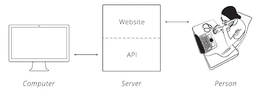
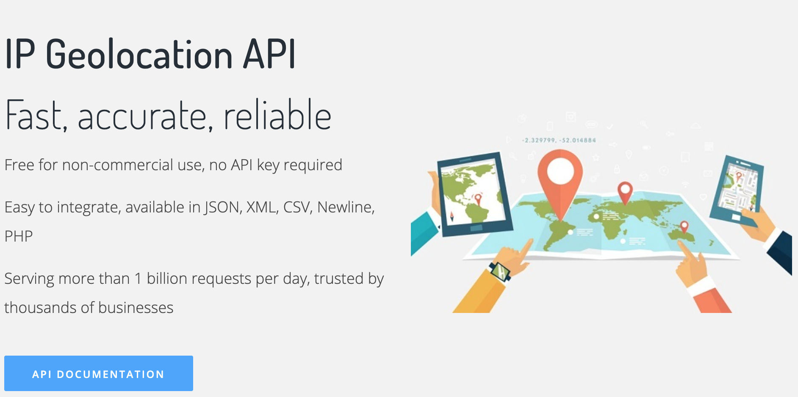
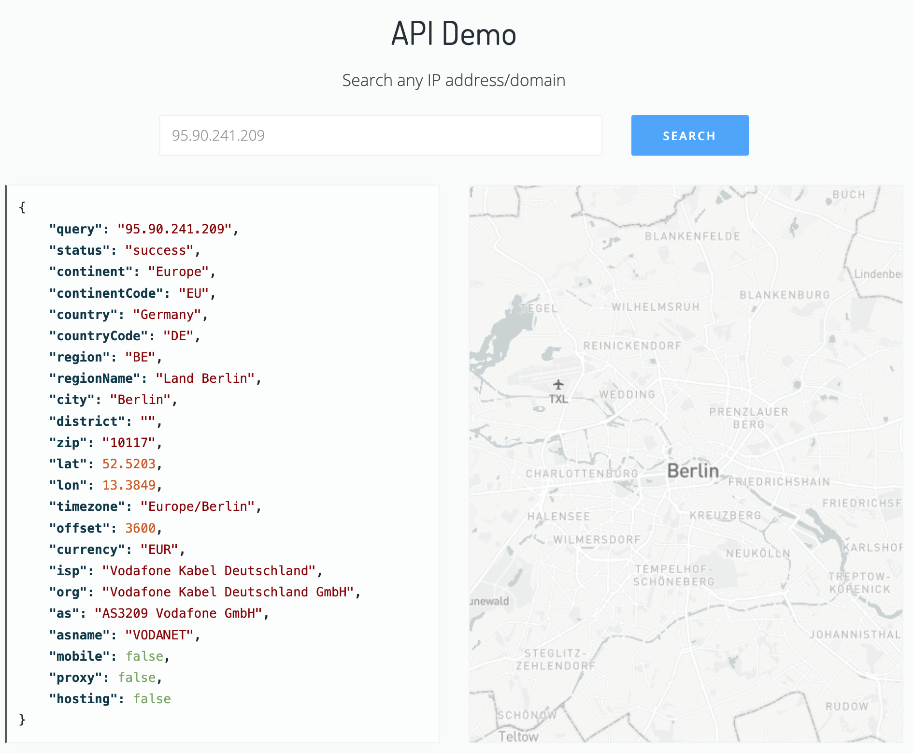
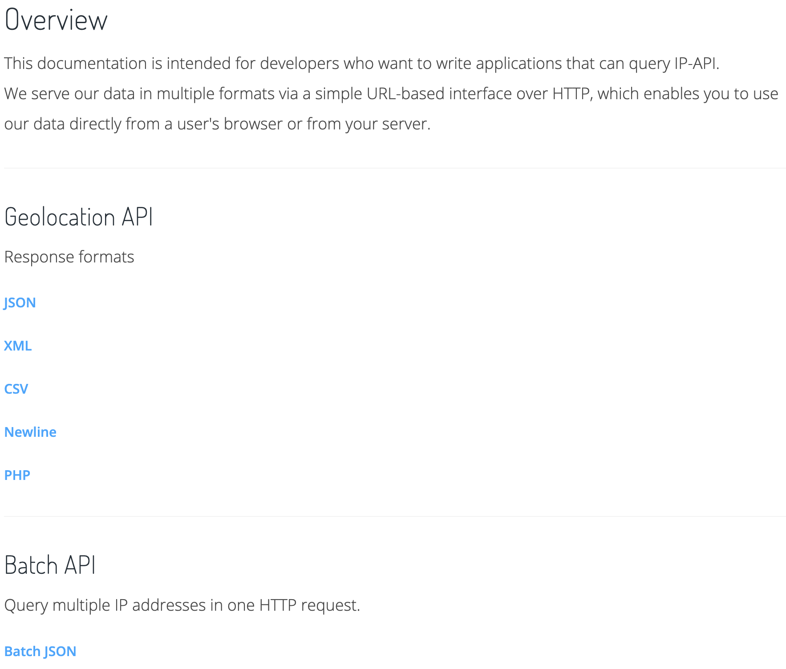
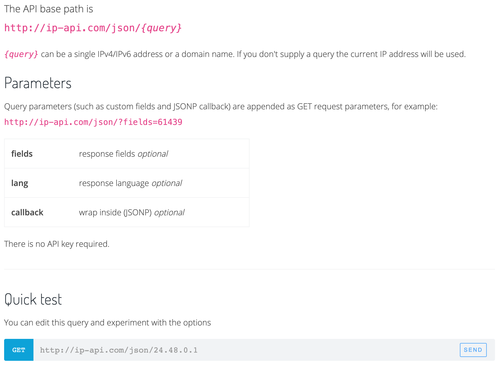
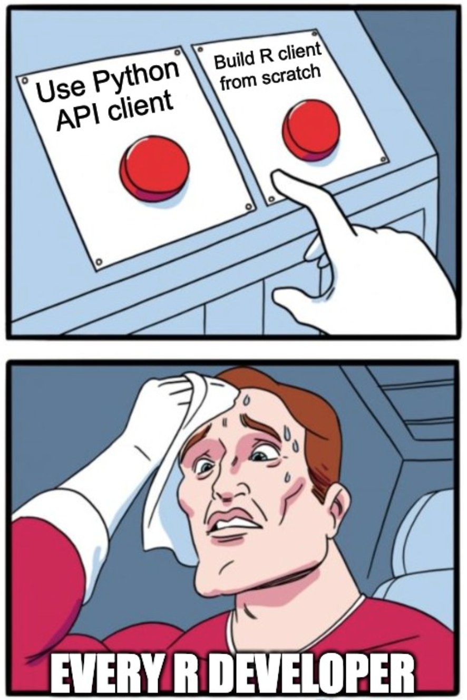
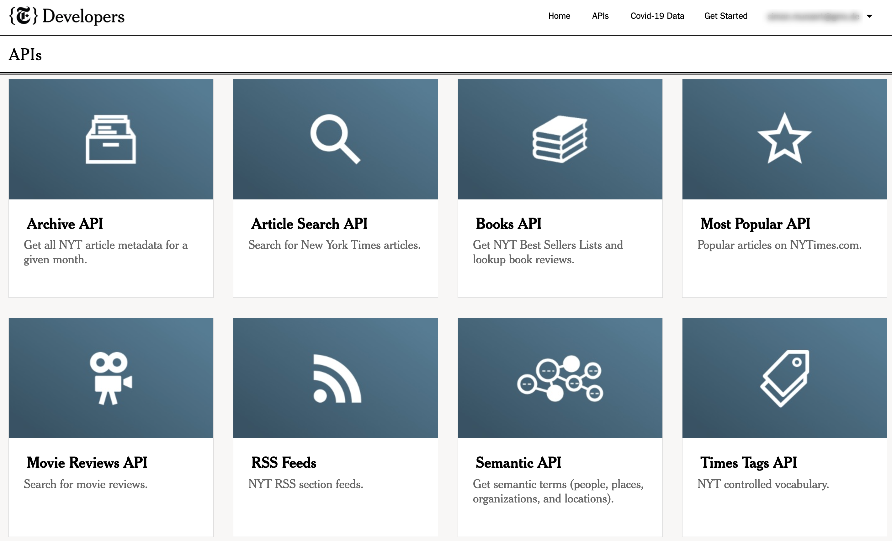
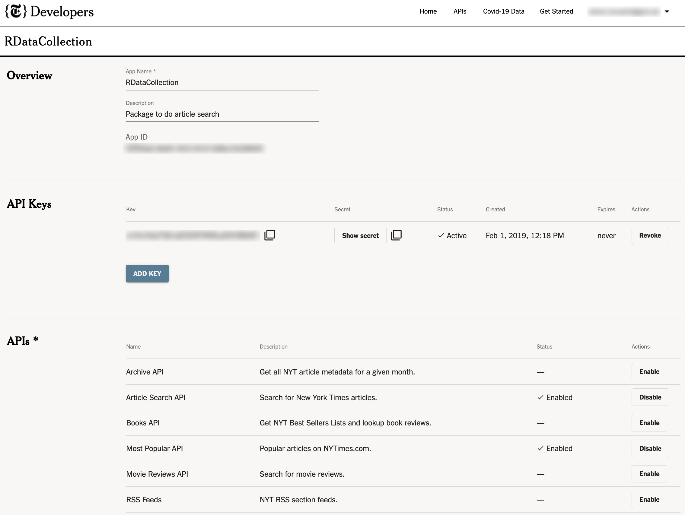

```{css, echo=FALSE} 
@media print { # print out incremental slides; see https://stackoverflow.com/questions/56373198/get-xaringan-incremental-animations-to-print-to-pdf/56374619#56374619
  .has-continuation {
    display: block !important;
  }
}
```

```{r setup, include=FALSE}
# figures formatting setup
options(htmltools.dir.version = FALSE)
library(tidyverse)
library(rvest)
library(httr)
library(knitr)
opts_chunk$set(
  prompt = T,
  fig.align="center", #fig.width=6, fig.height=4.5, 
  # out.width="748px", #out.length="520.75px",
  dpi=300, #fig.path='Figs/',
  cache=F, #echo=F, warning=F, message=F
  engine.opts = list(bash = "-l")
  )

## Next hook based on this SO answer: https://stackoverflow.com/a/39025054
knit_hooks$set(
  prompt = function(before, options, envir) {
    options(
      prompt = if (options$engine %in% c('sh','bash')) '$ ' else 'R> ',
      continue = if (options$engine %in% c('sh','bash')) '$ ' else '+ '
      )
})

library(tidyverse)
```


# Table of contents

<br><br>

1. [Scraping static webpages with R](#scrapingstatic)

2. [Web scraping: good practice](#goodpractice)

3. [Web APIs: the basics](#apibasics)

4. [JSON](#json)

5. [Summary](#summary)


---
class: inverse, center, middle
name: scrapingstatic

# Scraping static webpages with R

<html><div style='float:left'></div><hr color='#EB811B' size=1px style="width:1000px; margin:auto;"/></html>


---
# Technologies of the world wide web

.pull-left[

- To fully unlock the potential of web data for data science, we draw on certain web technologies.
- Importantly, often a basic understanding of these technologies is sufficient as the focus is on web data collection, not [web development](https://en.wikipedia.org/wiki/Web_development).
- Specifically, we have to understand
  - How our machine/browser/R communicates with web servers (→ **HTTP/S**)
  - How websites are built (→ **HTML**, **CSS**, basics of **JavaScript**)
  - How content in webpages can be effectively located (→ **XPath**, **CSS selectors**)
  - How dynamic web applications are executed and tapped (→ **AJAX**, **Selenium**)
  - How data by web services is distributed and processed (→ **APIs**, **JSON**, **XML**)
  
]

.pull-right-center[
<div align="center">
<br>

</div>
`Credit` [ADCR](http://r-datacollection.com/)
]


---
# Web scraping

.pull-left[

### What is web scraping?

1. Pulling (unstructured) data from websites (HTMLs)
2. Bringing it into shape (into an analysis-ready format)

### The philosophy of scraping with R

- No point-and-click procedure
- Script the entire process from start to finish
- **Automate**
  - The downloading of files
  - The scraping of information from web sites
  - Tapping APIs
  - Parsing of web content
  - Data tidying, text data processing
- Easily scale up scraping procedures
- Scheduling of scraping tasks
]

.pull-right-center[
<br>
<div align="center">

</div>
`Credit` [prowebscraping.com](http://prowebscraping.com/web-scraping-vs-web-crawling/)
]

---
# The scraping workflow

.pull-left[
### Key tools for scraping static webpages

1. You are able to inspect HTML pages in your browser using the web developer tools.
2. You are able to parse HTML into R with `rvest`.
3. You are able to speak XPath (or CSS selectors).
4. You are able to apply XPath expressions with `rvest`.
5. You are able to tidy web data with R/`dplyr`/`regex`.


### The big picture

- Every scraping project is different, but the coding pipeline is fundamentally similar.
- The (technically) hardest steps are location (XPath, CSS selectors) and extraction (clean-up), sometimes the scaling (from one to multiple sources).
]

.pull-right[
<br><br><br>
<div align="center">

</div>
]

---
# Web scraping with rvest

.pull-left-wide[

`rvest` is a suite of scraping tools. It is part of the tidyverse and has made scraping with R much more convenient.

There are three key `rvest` verbs that you need to learn.<sup>1</sup>

1. `read_html()`: Read (parsing) an HTML resource.

2. `html_elements()`: Find elements that match a CSS selector or XPath expression.

3. `html_text2()`: Extract the text/value inside the node set.


]

.footnote[
<sup>1</sup> There is more in `rvest` than what we can cover today. Have a glimpse at the [overview at tidyverse.org](https://rvest.tidyverse.org/) and at this excellent (unofficial) [cheat sheet](https://github.com/yusuzech/r-web-scraping-cheat-sheet).
]


.pull-right-small-center[
<div align="center">
<br>

</div>
]


---
# Web scraping with rvest: example

.pull-left-vsmall[
- We are going to scrape a information from a Wikipedia article on women philosophers available at [https://en.wikipedia.org/wiki/](https://en.wikipedia.org/wiki/List_of_women_philosophers) [List_of_women_philosophers](https://en.wikipedia.org/wiki/List_of_women_philosophers).
- The article provides two types of lists - one by period and one sorted alphabetically. We want the alphabetical list.
- The information we are actually interested in - names - is stored in unordered list elements.
]

.pull-right-vwide[
<div align="center">


<br>


</div>
]


---
# Scraping with rvest: example (cont.)

**Step 1:** Parse the page
```{r, eval = FALSE, message  = FALSE}
url_p <- read_html("https://en.wikipedia.org/wiki/List_of_women_philosophers")
```

```{r, eval = TRUE, echo = FALSE, message  = FALSE}
library(rvest)
url <- "https://en.wikipedia.org/w/index.php?title=List_of_women_philosophers&oldid=1041210397"
url_p <- read_html(url)
```

--

**Step 2:** Develop an XPath expression (or multiple) that select the information of interest and apply it

```{r, eval = TRUE}
elements_set <- html_elements(url_p, xpath = "//h2/span[text()='Alphabetically']//following::li/a[1]")

```

--

The XPath expression reads:

- `//h2`: Look for  `h2` elements anywhere in the document.
- `/span[text()='Alphabetically']`: Within that element look for `span` elements with the content `"Alphabetically"`.
- `//following::li`: In the DOM tree following that element (at any level), look for `li` elements.
- `/a[1]` within these elements look for the first `a` element you can find.

---
# Scraping with rvest: example (cont.)

**Step 3:** Extract information and clean it up

```{r, eval = TRUE}
phil_names <- elements_set %>% html_text2()
phil_names[c(1:2, 101:102)]
```

--

**Step 4:** Clean up (here: select the subset of links we care about)

```{r, eval = TRUE}
names_iffer <-
  seq_along(phil_names) >=  seq_along(phil_names)[str_detect(phil_names, "Felicia Nimue Ackerman")] &
  seq_along(phil_names) <=   seq_along(phil_names)[str_detect(phil_names, "Alenka Zupančič")]
philosopher_names_clean <- phil_names[names_iffer]
length(philosopher_names_clean)
philosopher_names_clean[1:5]
```


---
# Quick-n-dirty static webscraping with SelectorGadget

.pull-left[

### The hassle with XPath

- The most cumbersome part of web scraping (data tidying aside) is the construction of XPath expressions that match the components of a page you want to extract.
- It will take a couple of scraping projects until you’ll truly have mastered XPath.

### A much-appreciated helper

- **SelectorGadget** is a JavaScript browser plugin that constructs XPath statements (or CSS selectors) via a point-and-click approach.
- It is available here: http://selectorgadget.com/ (there is also a Chrome extension).
- The tool is magic and you will love it.

]

--

.pull-right[

### What does SelectorGadget do?

- You activate the tool on any webpage you want to scrape.
- Based on your selection of components, the tool learns about your desired components and generates an XPath expression (or CSS selector) for you.

### Under the hood

- Based on your selection(s), the tool looks for similar elements on the page.
- The underlying algorithm, which draws on Google’s diff-match-patch libraries, focuses on CSS characteristics, such as tag names and `<div>` and `<span>` attributes.

]

---
# SelectorGadget: example

<video width="980" height="551" controls>
  <source src="pics/selectorgadget-nytimes.mp4" type="video/mp4">
Your browser does not support the video tag.
</video>


---
# SelectorGadget: example (cont.)

```{r, eval = FALSE}
library(rvest)
url_p <- read_html("https://www.nytimes.com")
# xpath: paste the expression from Selectorgadget!
# note: we use single quotation marks here (' instead of ") to wrap around the expression!
xpath <- '//*[contains(concat( " ", @class, " " ), concat( " ", "erslblw0", " " ))]//*[contains(concat( " ", @class, " " ), concat( " ", "e1lsht870", " " ))]'
headlines <- html_elements(url_p, xpath = xpath) 
headlines_raw <- html_text(headlines)
length(headlines_raw)
head(headlines_raw)
```

```{r, eval = TRUE, echo = FALSE}
library(rvest)
url_p <- read_html("materials/nytimes-com-2021-09-29.html")
xpath <- '//*[contains(concat( " ", @class, " " ), concat( " ", "erslblw0", " " ))]//*[contains(concat( " ", @class, " " ), concat( " ", "e1lsht870", " " ))]'
headlines <- html_elements(url_p, xpath = xpath) # we use single quotation marks here to wrap around the expression!
headlines_raw <- html_text(headlines)
length(headlines_raw)
head(headlines_raw)
```


---
# SelectorGadget: when to use and not to use it

Having learned about a semi-automated approach to generating XPath expressions, you might ask: 

**Why bother with learning XPath at all?**

Well...

- SelectorGadget is not perfect. Sometimes, the algorithm will fail.
- Starting from a different element sometimes (but not always!) helps.
- Often the generated expressions are unnecessarily complex and therefore difficult to debug.
- In my experience, SelectorGadget works 50-60% of the times when scraping from static webpages.
- You are also prepared for the remaining 40-50%!


---
# Scraping HTML tables

<div align="center">


<br>

</div>


---
# Scraping HTML tables

- HTML tables are everywhere.
- They are easy to spot in the wild - just look for `<table>` tags!
- Exactly because scraping tables is an easy and repetitive task, there is a dedicated `rvest` function for it: `html_table()`.

.pull-left-vsmall[
<br>
<br>
**Function definition**
```{r, eval = FALSE}
html_table(x, 
    header = NA,
    trim = TRUE,
    dec = ".",
    na.strings = "NA",
    convert = TRUE
 )
```
]

.pull-right-vwide[
<br>

| Argument |  Description |
|---|---|
| `x` | Document (from `read_html()`) or node set (from `html_elements()`). |
| `header` | Use first row as header? If `NA`, will use first row if it consists of `<th>` tags. |
| `trim` | Remove leading and trailing whitespace within each cell? |
| `dec` | The character used as decimal place marker. |
| `na.strings` | Character vector of values that will be converted to `NA` if `convert` is `TRUE`. |
| `convert` | If `TRUE`, will run `type.convert()` to interpret texts as int, dbl, or `NA`. |
]

---
# Scraping HTML tables: example

.pull-left-small[
- We are going to scrape a small table from the Wikipedia page [https://en.wikipedia.org/wiki/](https://en.wikipedia.org/wiki/List_of_human_spaceflights) [List_of_human_spaceflights](https://en.wikipedia.org/wiki/List_of_human_spaceflights).
- (Note that we're actually using an old version of the page (dating back to May 1, 2018), which is accessible [here](https://en.wikipedia.org/w/index.php?title=List_of_human_spaceflights&oldid=778165808). Wikipedia pages change, but this old revision and associated link won't.))
- The table is not entirely clean: There are some empty cells, but also images and links.
- The HTML code looks straightforward though.
]

.pull-right-wide[
<div align="center">


<br>

</div>
]

---
# Scraping HTML tables: example (cont.)

```{r, eval = FALSE}
library(rvest)
url <- "https://en.wikipedia.org/wiki/List_of_human_spaceflights"
url_p <- read_html(url)
tables <- html_table(url_p, header = TRUE)
spaceflights <- tables[[1]]
spaceflights
```


```{r, eval = TRUE, echo = FALSE}
library(rvest)
url <- "https://en.wikipedia.org/w/index.php?title=List_of_human_spaceflights&oldid=778165808"
url_p <- read_html(url)
tables <- html_table(url_p, header = TRUE)
spaceflights <- tables[[1]]
spaceflights
```


---
class: inverse, center, middle
name: goodpractice

# Web scraping: good practice

<html><div style='float:left'></div><hr color='#EB811B' size=1px style="width:1000px; margin:auto;"/></html>


---
# Scraping: the rules of the game

<br>

1. You take all the responsibility for your web scraping work.

2. Think about the nature of the data. Does it entail sensitive information? Do not collect personal data without explicit permission.

3. Take all copyrights of a country’s jurisdiction into account. If you publish data, do not commit copyright fraud.

4. If possible, stay identifiable. Stay polite. Stay friendly. Obey the scraping etiquette.

5. If in doubt, ask the author/creator/provider of data for permission—if your interest is entirely scientific, chances aren’t bad that you get data.

---
# Consult robots.txt

.pull-left[
### What's robots.txt?

-  "[Robots exclusion standard](https://en.wikipedia.org/wiki/Robots_exclusion_standard)", informal protocol to prohibit web robots from crawling content
- Located in the root directory of a website (e.g.,  [google.com/robots.txt](https://www.google.com/robots.txt))
- Documents which bot is allowed to crawl which resources (and which not)
- Not a technical barrier, but a sign that asks for compliance

### What's robots.txt?

- Not an official W3C standard
- Rules listed bot by bot
- General rule listed under `User-agent: *` (most interesting entry for R-based crawlers)
- Directories folders listed separately
]

.pull-right[

**Example**

```{txt, prompt = FALSE, eval = FALSE}
User-agent: Googlebot 
Disallow: /pics/ 
Disallow: /private/
```

**Universal ban**

```{txt, prompt = FALSE, eval = FALSE}
User-agent: * 
Disallow: /
```

**Allow declaration**

```{txt, prompt = FALSE, eval = FALSE}
User-agent: * 
Disallow: /pics/ 
Allow: /pics/public/
```

**Crawl delay (in seconds)**

```{txt, prompt = FALSE, eval = FALSE}
User-agent: *
Crawl-delay: 2
```


]


---
# Downloading HTML files

.pull-left[

### Stay modest when accessing lots of data

- Content on the web is publicly available.
- But accessing the data causes server traffic.
- Stay polite by querying resources as sparsely as possible.

### Two easy-to-implement practices

1. Do not bombard the server with requests - and if you have to, do so at modest pace.
2. Store web data on your local drive first, then parse.

]


.pull-right[

### Looping over a list of URLs

```{r, eval = FALSE}
for (i in 1:length(list_of_urls)) { 
  if (!file.exists(paste0(folder, file_names[i]))) {
    download.file(list_of_urls[i],
                  destfile = paste0(folder, file_names[i])
                  )
    Sys.sleep(runif(1, 1, 2))
    }
}
```

- `!file.exists()` checks whether a file does not exist in the specified location.
- `download.file()` downloads the file to a folder. The destination file (location + name) has to be specified.
- `Sys.sleep()` suspends the execution of R code for a given time interval (in seconds).
]

---
# Staying identifiable

.pull-left[

### Don't be a phantom

- Downloading massive amounts of data may arouse attention from server administrators.
- Assuming that you've got nothing to hide, you should stay identifiable beyond your IP address.

### Two easy-to-implement practices

1. Get in touch with website administrators / data owners.
2. Use HTTP header fields `From` and `User-Agent` to provide information about yourself (by passing these to `add_headers()` from the `httr` library).

]


.pull-right[

### Staying identifiable in practice

```{r, eval = FALSE}
url <- "http://a-totally-random-website.com"
rvest_session <- session(url, 
 add_headers(From = "my@email.com", 
             `UserAgent` = 
               R.Version()$version.string
             )
) 
headlines <- rvest_session %>% 
             html_elements(xpath = "p//a") %>% 
             html_text()
```


- `rvest`'s `session()` creates a session object that responds to HTTP and HTML methods.
- Here, we provide our email address and the current R version as `User-Agent` information.
- This will pop up in the server logs: The webpage administrator has the chance to easily get in touch with you.

]


---
# Scraping etiquette (cont.)

<div align="center">

</div>


---
class: inverse, center, middle
name: apibasics

# Web APIs: the basics

<html><div style='float:left'></div><hr color='#EB811B' size=1px style="width:1000px; margin:auto;"/></html>


---
# What are web APIs?

.pull-left[
### Definition

- A web <b>A</b>pplication <b>P</b>rogramming <b>I</b>nterface lets you/your program query a provider for specific data.
- Think of web APIs as "data search engines": You pose a request, the API answers with a bulk of data.
- Many popular web services provide APIs (Google, Twitter, Wikipedia, ...).
- Often, APIs provide data in JSON, XML (can be any format though).

<div align="center">

</div>
`Credit` [Brian Cooksey](https://zapier.com/learn/apis/chapter-1-introduction-to-apis/)
]

--

.pull-right[
### Key concepts

- **Server:** A computer that runs an API and can be talked to.
- **Client:** A program that exchanges data with a server through an API.
- **Protocol:** The rule set underlying how computers talk to each other (e.g. HTTP).
- **Method:** The "verbs" that clients use to talk with a server (in HTTP speak: `GET`, `POST`, and others).
- **Endpoint:** URLs that can be specified in a particular way to query the API database.
- **Request:** What the client asks of the server (see Methods above).
- **Response:** The server's response. This includes a *Status Code* (e.g. "200", "404"), a *Header* (meta-information about the reponse), and a *Body* (the actual content that we're interested in).
]

---
# What do APIs do?

.pull-left[
### Key perks from a web scraping perspective

- APIs provide instance access to clean data.
- They free us from building manual scrapers.
- They make it easier for a computer to interact with data on server.
- API usage implies mutual agreement about data collection.

<div align="center">

</div>


]

--

.pull-right[
### Restaurant analogy<sup>1</sup><br><br>

| Restaurant  |  Web API |
|---|---|
| You, the client  | Your program/computer |
| The restaurant  | API provider |
| The waiter | API | 
| The menu | API documentation |
| Your order | Specified API endpoint (request) | 
| The kitchen | API database |
| The food | API response |
| The bill | API pricing |

.footnote[<sup>1</sup> [Kitchen example inspired by Jason Johl](https://blogs.mulesoft.com/learn-apis/api-led-connectivity/what-are-apis-how-do-apis-work/)]
]


---
# Why do organizations have APIs?

.pull-left-vwide[
### Scalability and regulation of access

- Imagine if everyone decided to retrieve data from a server in an unstructured way. The amount of energy that this would consume would be very high. 
- Also, access to data would be largely unregulated.
- With APIs, organizations can provide a regulated and organized way for clients to retrieve a large amount of data, without overwhelming or crashing their server, or violating their Terms of Use.

### More reasons

- **Monetization:** Data can be turned into a sellable product.
- **Innovation:** Clients have access to data and develop their own products and solutions.
- **Expansion:** APIs can help companies move to different markets or partner with other companies.
]

.pull-right-vsmall[
<br>
<div align="center">
<br>
<br>
<br>
<br>
<br>
</div>
]


---
# Example: Working with the IP API

.pull-left[
### The IP API

- The IP API at [https://ip-api.com/](https://ip-api.com/) takes IP addresses and provides geolocation data (latitude, longitude, but also country state, city, etc.) in return. 
- This is useful if you want to, e.g., map IP address data (although this is [not perfectly accurate](https://en.wikipedia.org/wiki/Internet_geolocation)).
- The API is free to use and requires no registration. (There's also a pro service for commercial use though.)

<div align="center">

</div>
]

.pull-right[
### An example JSON response

<br>
<div align="center">

</div>
]

---
# Example: Documentation

.pull-left[
### Overview

<br>
<div align="center">

</div>
]

.pull-right[
### JSON endpoint

<br>
<div align="center">

</div>
]


---
# Example: Calling the API with R

.pull-left[
First, we specify the endpoint. We use the JSON endpoint and start with an empty query field.
```{r}
endpoint <- "http://ip-api.com/json"
```

Next, we call the API with `httr`'s `GET()` method. 

```{r}
endpoint <- "http://ip-api.com/json"
response <- httr::GET(endpoint)
response
```
]

--

.pull-right[
Hooray, we successfully called the API and got JSON data in return! We inspect the content with `httr`'s `content()` function.

```{r, R.options = list(width = 30)}
response_parsed <- httr::content(response)
response_parsed
```
]


---
# Example: Calling the API with R *cont.*

.pull-left[
This looks like an R list, which is useful. `httr::content()` automatically parsed the JSON file into an R list, which is useful. We could have also kept the raw (here: text) content with `httr::content(as = "text")`.

For more convenience (and flexibility), we can also use the powerful `jsonlite` package and its parser:

```{r}
response_parsed <- jsonlite::fromJSON(endpoint)
response_parsed
```
]


--

.pull-right[
Given that the data structure is low-dimensional, we can easily map it onto a data frame:

```{r, R.options = list(width = 30)}
as.data.frame(response_parsed)
```
]

---
# Example: Calling the API with R *cont.*

.pull-left[
We can easily modify the call to retrieve more data:

```{r}
endpoint <- "http://ip-api.com/json/91.198.174.1"
response_parsed <- jsonlite::fromJSON(endpoint)
response_parsed
```
]

--

.pull-right[
The API also allows for batch processing. This gives you the ability to query multiple IP addresses in one HTTP request, which is significantly faster than submitting individual queries. To that end, the batch of IP addresses or domains must be sent using a `POST` request:

```{r}
endpoint <- "http://ip-api.com/batch"
response <- httr::POST(url = endpoint, body = 
    '["208.80.152.201", "91.198.174.192"]', encode = "json")
httr::content(response, as = "text") %>% 
  jsonlite::fromJSON() %>% 
  as.data.frame()
```
]


---
# Accessing APIs with R

.pull-left[
### Is there a pre-built API client for R?

1. **Yes.** Great. Use it if it provides the functionality you need (if not, see option 2).
2. **No.** Build your own API client.

<div align="center">

</div>
]

--

.pull-right[
### API clients

- Provide an interface to APIs
- Hide the API back-end
- Let you stay in your programming environment
- Good news: In most cases, this will be the world you live in
- Please always cite package authors when you use their work. Run `citation("<package name>")` to see how.

### Building a client from scratch

- Dive into the API documentation
- Write your own functions to specify endpoint calls and turn API output into R data structures
- Build infrastructure for API authentication if necessary
]

---
# API clients: example

The [`ipapi` package](https://github.com/hrbrmstr/ipapi) by Bob Rudis provides high-level access to the IP API. You just have to install it and can then work with the `geolocate()` function provided by the package to call the API.

```{r, message = FALSE}
# devtools::install_github("hrbrmstr/ipapi") # uncomment to install if necessary
library(ipapi)
ip_df <- geolocate(c("", "10.0.1.1", "72.33.67.89", "www.spiegel.de"), .progress=TRUE)
ip_df
```


---
# Restricted API access

### Why API access can be restricted

- The service provider wants to know who uses their API.
- Hosting APIs is costly. API usage limits can help control costs.
- The API hoster has a commercial interest: You pay for access (sometimes for advanced features or massive queries only).

### Access tokens

- Access tokens serve as keys to an API.
- They usually come in form of a randomly generated string, such as `dk5nSj485jJZP3847kjU`.
- Obtaining a token requires registration; sometimes payment. Sometimes disclosure of your intentions.
- Once you have the token, you pass it along with your regular API call using a key parameter.


---
# Restricted API access: example

.pull-left[
The *New York Times* provides several APIs for developers at [https://developer.nytimes.com/](https://developer.nytimes.com/). In order to use them, we have to register as a developer (for free) and register our app. Then, we can use that key to call one of the APIs.

<div align="center">

</div>
]

.pull-right[
<br>
<div align="center">

</div>
]

---
# Restricted API access: example *cont.*

First, we load the key that we stored separately as a string (here: `nytimes_apikey` stored in `rkeys.RDa`).

```{r}
load("/Users/simonmunzert/rkeys.RDa")
``` 

Next we specify the API endpoint using the API key:

```{r}
endpoint <- "https://api.nytimes.com/svc/mostpopular/v2/viewed/1.json?"
url <- paste0(endpoint, "api-key=", nytimes_apikey)
```

Finally, we call the API and inspect the results:

```{r}
nytimes_most_popular <- jsonlite::fromJSON(url)
nytimes_most_popular$results$title[1:3]
```

---
# Restricted API access: some advice

**NEVER** hard-code your personal API key (or any personal information for that matter) in R scripts that you plant to stare. 

Instead, use one of the following options:

1. Store your API keys in a separate file that you store somewhere else and only import for the purpose of using them (see previous example).
2. Store your API keys in environment variables.

For the second option, you can use `Sys.setenv()` and `Sys.getenv()` as in:

```{r}
## Set new environment variable called MY_API_KEY. Current session only. Don't store code in script.
Sys.setenv(MY_API_KEY="abcdefghijklmnopqrstuvwxyz0123456789") 

## Assign the environment variable to an R object and pass it on where needed.
my_api_key = Sys.getenv("MY_API_KEY")
```

The downside of this approach is that this environment variable will not persist across sessions. To make it persistent (on your system), you should modify the `.Renvion` file. Check out [these instructions](https://raw.githack.com/uo-ec607/lectures/master/07-web-apis/07-web-apis.html#Aside:_Safely_store_and_use_API_keys_as_environment_variables) to learn how that works.


---
# Recap: tapping APIs with R

1. Figure out whether an API is available that serves your needs.

2. Figure out whether an up-to-date and fully functional R client for API is available. Make yourself familiar with the API Terms of Use and client functionality, then use it.

3. If no client is available, build your own. 

  a. Dive into the documentation.
  
  b. Use `httr` package to construct requests.
  
  c. Use `jsonlite` package to parse the JSON response (or other parsers such as `xml2`, depending on API output).
  
  d. Address API error handling, user agent, authentication, pagination issues. (See [here](https://httr.r-lib.org/articles/api-packages.html) for more info.)
  
  e. Write useful high-level functions that wrap your API calls and parsing operations.
  
  f. Consider publishing your R API client as a package.


---
class: inverse, center, middle
name: json

# JSON

<html><div style='float:left'></div><hr color='#EB811B' size=1px style="width:1000px; margin:auto;"/></html>


---
# What's JSON?

.pull-left[
### Quick facts
- <b>J</b>ava<b>S</b>cript <b>O</b>bject <b>N</b>otation
- Popular data exchange format for web services / APIs
- "the fat-free alternative to XML"
- JSON ≠ Java, but a subset of JavaScript
- However, very flexible and not dependent upon any programming language
- Import of JSON data into R is relatively straightforward with the `jsonlite` package

<div align="center">

</div>
]

.pull-right-center[
<br><br>
<div align="center">

</div>
]

---
# Example

```{}
[
   {
      "name" : "van Pelt, Lucy",
      "sex" : "female",
      "age" : 32
   },
   {
      "name" : "Peppermint, Patty",
      "sex" : "female",
      "age" : null
   },
   {
      "name" : "Brown, Charlie",
      "sex" : "male",
      "age" : 27
   }
]
```

---
# Basic syntax

.pull-left[
### Types of brackets

1. Curly brackets, `{` and `}`, embrace objects. Objects work similar to elements in XML/HTML and can contain other objects, key-value pairs or arrays.
2. Square brackets, `[` and `]`, embrace arrays. An array is an ordered sequence of objects or values.

### Data structure

JSON can map complex data structures (objects nested within objects etc.), which can make it difficult to convert JSON into flattened R data structures (e.g., a data frame).

Also, there is no ultimate JSON-to-R converting function.

Luckily, JSON files returned by web services are usually not very complex. And `jsonlite` simplifies matters a lot. 
]

.pull-right[
### Key-value pairs

Keys are put in quotation marks; values only if they contain string data.

```{}
"name" : "van Pelt, Lucy"
"age" : 32
```

Keys and values are separated by a colon.

```{}
"age" : 32
```

Key-value pairs are separated by commas.

```{}
{"name" : "van Pelt, Lucy", "age" : 32}
```

Values within arrays are separated by commas.

```{}
["van Pelt, Lucy", "Peppermint, Patty"]
```
]


---
# JSON and R

.pull-left[
### Parsing JSON with R

- There are different packages available for JSON parsing with R.
- Choose [`jsonlite`](https://cran.r-project.org/web/packages/jsonlite/index.html) by Jeroen Ooms: It's well maintained and provides convincing mapping rules.

### Key functions

There are two key functions in `jsonlite`:

- `fromJSON()`: converts input from JSON data into R objects following a set of [conventions](https://arxiv.org/abs/1403.2805).
- `toJSON()`: converts input from R objects into JSON data

Get started with the package following [this vignette](https://cran.r-project.org/web/packages/jsonlite/vignettes/json-aaquickstart.html).
]

.pull-right[
### Conversion rules of `jsonlite`

```{r, message=FALSE}
library(jsonlite)
x <- '[1, 2, true, false]'
fromJSON(x)
x <- '["foo", true, false]'
fromJSON(x)
x <- '[1, "foo", null, false]'
fromJSON(x)
```
]


---
class: inverse, center, middle
name: summary

# Summary

<html><div style='float:left'></div><hr color='#EB811B' size=1px style="width:1000px; margin:auto;"/></html>


---
# More on web scraping

Until now, the toy scraping examples were limited to single HTML pages. However, often we want to **scrape data from multiple pages**. You might think of newspaper articles, Wikipedia pages, shopping items and the like. In such scenarios, automating the scraping process becomes really powerful. Also, principles of polite scraping are more relevant then.

In other cases, you might be confronted with 
- forms, 
- authentication, 
- dynamic (JavaScript-enriched) content, or want to 
- automatically navigate through pages interactively.

There's only so much we can cover in one session. Check out more material online [here](https://github.com/hertie-data-science-lab/ds-workshop-webscraping) and [there](https://github.com/yusuzech/r-web-scraping-cheat-sheet) to learn about solutions to some of these problems.


---
# More on web APIs

Collecting data from the web using APIs provided by the data owner represents the **gold standard of web data retrieval**. It allows for pure data collection without "HTML layout waste", standardized data access, de facto agreement on data collection by the data owner, and robustness and scalability of data collection.

On the other hand, the rise of API architectures is not without issues. It requires knowledge of the architecture and creates dependencies on API suppliers. While APIs have the potential to make data access more democratic, they can also add to the siloing of information.

If you want to learn more about APIs in depth, check out [this introduction to APIs](https://zapier.com/learn/apis/chapter-1-introduction-to-apis/). Or, check out this [hands-on intro video to APIs in R by Leo Glowacki](https://www.youtube.com/watch?v=kZU240u9H3E&t=2248s).

There are many resources that give an overview of existing public APIs, including [ProgrammableWeb](https://www.programmableweb.com/apis/directory) and this [List of public APIs on GitHub](https://github.com/public-apis/public-apis). Another useful resource is [APIs for social scientists - a collaborative review](https://bookdown.org/paul/apis_for_social_scientists/).

Finally, if you plan to write an R client for a web API, check out [this guide](https://httr.r-lib.org/articles/api-packages.html).


---

# Coming up

<br><br> 

### Assignment

Assignment 3 is about to go online. Check it out and start scraping the web (politely).

### Next lecture

Model fitting and evaluation. Now that we know how to retrieve data, let's learn how to model and learn from them.


